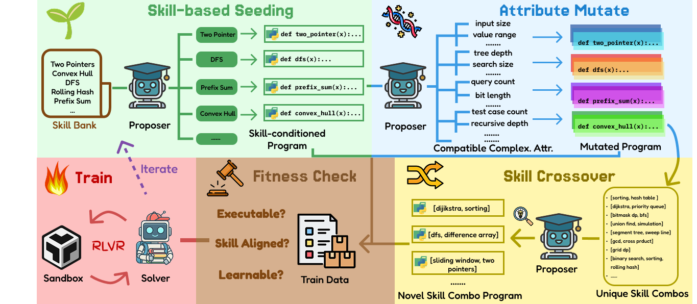

# EvoTD: Advancing Reasoning Frontiers via Skill Composition and Complexity Scaling

EvoTD is an evolutionary task synthesis framework that automatically generates diverse coding tasks for training language models via reinforcement learning. It analyzes seed problems to extract atomic skills, then uses genetic operators (initialization, mutation, crossover) to synthesize new tasks with controlled skill coverage and complexity.



## Overview

The pipeline consists of five phases:

```
Seed Dataset (e.g., USACO)
        │
        ▼
┌───────────────────┐
│ Skill & Attribute │  LLM labels skills and complexity attributes
│    Extraction     │  per seed problem, then clusters them
└────────┬──────────┘
         ▼    
┌──────────────────┐
│  Task Synthesis  │  Genetic operators: Init → Mutate → Crossover
└────────┬─────────┘
         ▼
┌───────────────────┐
│ Task Verification │  Skill check → Code execution → Difficulty filtering
└────────┬──────────┘
         ▼
┌─────────────────┐
│   RL Training   │  DAPO with vLLM rollout on synthesized tasks
└─────────────────┘
```

> **Note:** The seed dataset can be varied (e.g., USACO, TACO). In this project, we use USACO as the default seed dataset.

## Installation

```bash
pip install -r requirements.txt
```

## LLM API Configuration

EvoTD uses [LiteLLM](https://docs.litellm.ai/docs/providers) as a unified interface for LLM API calls. This means you can use **any LLM provider** (OpenAI, Azure, Anthropic, DeepSeek, etc.) by simply setting the appropriate environment variables and specifying the correct model name.

### Setting Up Your Provider

1. **Set environment variables** for your chosen provider:

   | Provider   | Environment Variables                                         |
   |------------|---------------------------------------------------------------|
   | OpenAI     | `OPENAI_API_KEY`                                              |
   | Azure      | `AZURE_API_KEY`, `AZURE_API_BASE`, `AZURE_API_VERSION`        |
   | Anthropic  | `ANTHROPIC_API_KEY`                                           |
   | DeepSeek   | `DEEPSEEK_API_KEY`                                            |
   | Google     | `GEMINI_API_KEY`                                              |

   For a full list of supported providers, see the [LiteLLM documentation](https://docs.litellm.ai/docs/providers).

2. **Specify the model name** using LiteLLM's naming convention via the `--proposer` argument:

   | Provider   | Example `--proposer` value            |
   |------------|---------------------------------------|
   | OpenAI     | `gpt-4o` or `openai/gpt-4o`          |
   | Azure      | `azure/o4-mini`                       |
   | Anthropic  | `anthropic/claude-sonnet-4-20250514`      |
   | DeepSeek   | `deepseek/deepseek-chat`              |
   | Google     | `gemini/gemini-2.5-flash`             |

### Example

```bash
# Using OpenAI
export OPENAI_API_KEY="sk-..."

# Using Azure OpenAI
export AZURE_API_KEY="..."
export AZURE_API_BASE="https://your-resource.openai.azure.com/"
export AZURE_API_VERSION="2024-12-01-preview"
```
## Configuration

The pipeline reads from `src/proposer_config.yml`. You need to configure it before running. Key sections:

```yaml
# Skill synthesis
skill_synthesizer:
  proposer:
    o4-mini:                        # Must match --proposer argument
      max_tokens: 100000
  skill_out_file_path: data/skill
  cluster_out_file_path: data/cluster

# Task proposer
task_proposer:
  proposer:
    o4-mini:
      max_tokens: 100000
  task_out_file_path: data/task
  num_inputs: 10
  banned_keywords:                  # Keywords banned in generated code
    - logging
    - random
    - multiprocessing
    - subprocess
    - threading
    - datetime
    - time
    # ... (see config file for full list)
  remove_after_return: true
  remove_comments: true
  remove_print: true

# Task verifier
task_verifier:
  rollout: 10                       # Number of solver attempts per task
  check_determinism: true
  proposer:
    o4-mini:
      max_tokens: 30000
  solver:
    qwen3-4b: <YOUR_HF_MODEL_PATH> # e.g., Qwen/Qwen3-4B
    max_tokens: 8096
    temperature: 1.0
    top_p: 0.99
    seed: 42
    stop_words: ["</answer>"]
```

> **Note:** The proposer key (e.g., `o4-mini`) in the config must match the `--proposer` CLI argument exactly.

## Usage

### Step 1: Task Synthesis

The main pipeline runs skill extraction, task proposal, and task verification in sequence. You need to run it three times for the three task types (`code_out`, `code_in`, `code_func`):

```bash
# Configure
export CUDA_VISIBLE_DEVICES=0,1,2,3

DATASET="usaco"
PROPOSER="azure/o4-mini"          # LLM for proposing tasks (use your provider's model name)
SOLVER="qwen3-4b"                 # Local model for difficulty verification
PROPOSER_BATCH_SIZE=100
SOLVER_BATCH_SIZE=10000000        # Large number for whole-batch processing
ITERATION=0
LOWER_BOUND=0.0
UPPER_BOUND=1.0

# Run for each task type sequentially
for TASK_TYPE in code_out code_in code_func; do
    python src/main.py \
        --dataset $DATASET \
        --proposer $PROPOSER \
        --proposer_batch_size $PROPOSER_BATCH_SIZE \
        --solver_batch_size $SOLVER_BATCH_SIZE \
        --task_type $TASK_TYPE \
        --solver $SOLVER \
        --iteration $ITERATION \
        --lower_bound $LOWER_BOUND \
        --upper_bound $UPPER_BOUND
done
```

Or use the provided script (after editing `script/init_api_key.sh` with your API keys):

```bash
bash script/run.sh
```

#### CLI Arguments

| Argument | Description | Required |
|----------|-------------|----------|
| `--dataset` | Dataset name (`usaco` or `taco`) | Yes |
| `--proposer` | LiteLLM model name for task proposal (e.g., `azure/o4-mini`, `gpt-4o`) | Yes |
| `--solver` | Local solver model key as defined in config (e.g., `qwen3-4b`) | Yes |
| `--task_type` | Task type: `code_out`, `code_in`, or `code_func` | Yes |
| `--proposer_batch_size` | Batch size for LLM API calls | No |
| `--solver_batch_size` | Batch size for local solver verification | No |
| `--iteration` | Iteration number for curriculum learning (default: `0`) | No |
| `--lower_bound` | Min acceptable difficulty score (default: `0.0`) | No |
| `--upper_bound` | Max acceptable difficulty score (default: `1.0`) | No |

#### Task Types

- **`code_out`**: Given code + input, predict the output
- **`code_in`**: Given code + output, predict the input
- **`code_func`**: Given a problem description, write a function that satisfies input-output pairs

### Step 2: RL Training

After task synthesis, train a model using DAPO (Distributed Action Policy Optimization):

```bash
cd src

TRAIN_FILE="<path_to_synthesized_tasks.jsonl>"
TEST_FILE="<path_to_test_file.jsonl>"
MODEL_PATH="<path_to_base_model>"   # e.g., Qwen/Qwen3-4B
CKPTS_DIR="<path_to_save_checkpoints>"

bash ../script/train_qwen3-4b.sh
```

Key training parameters (configurable in `script/train_qwen3-4b.sh`):

| Parameter | Default | Description |
|-----------|---------|-------------|
| `train_bsz` | 64 | Training batch size |
| `n_resp_per_prompt` | 16 | Number of rollout responses per prompt |
| `lr` | 1e-6 | Learning rate |
| `total_epochs` | 12 | Total training epochs |
| `adv_estimator` | grpo | Advantage estimator (GRPO) |
| `max_prompt_length` | 6144 | Max prompt token length |
| `max_response_length` | 8096 | Max response token length |

### Step 3: Checkpoint Conversion

Convert FSDP checkpoints to HuggingFace format for inference:

```bash
cd src

python -m verl.model_merger merge \
    --backend fsdp \
    --local_dir <fsdp_checkpoint_dir> \
    --target_dir <hf_output_dir>
```

## Project Structure

```
EvoTD/
├── dataset/
│   └── usaco.json                    # USACO competitive programming dataset (307 problems)
├── script/
│   ├── run.sh                        # Main task synthesis script
│   ├── train_qwen3-4b.sh             # RL training script (DAPO)
│   └── convert_checkpoint.sh         # FSDP → HuggingFace checkpoint converter
├── src/
│   ├── main.py                       # Main pipeline orchestration
│   ├── skill_synthesizer.py          # Skill extraction & clustering
│   ├── task_proposer.py              # Task generation (init/mutate/crossover)
│   ├── task_verifier.py              # Task validation (skill/execution/difficulty)
│   ├── reward_function.py            # Training reward computation
│   ├── prompts.py                    # All LLM prompt templates
│   ├── proposer_config.yml           # Pipeline configuration
│   ├── utils/
│   │   ├── utils.py                  # Logging, config loading, helper functions
│   │   ├── data.py                   # Dataset loading (auto-downloads from Google Drive)
│   │   ├── parsers.py                # LLM response parsing
│   │   ├── python_executor.py        # Sandboxed code execution & evaluation
│   │   ├── equality.py               # Deep equality checking for outputs
│   │   ├── checks.py                 # Security checks (banned imports)
│   │   └── templates.py              # Code execution templates
│   └── verl/                         # VERL training framework
│       ├── trainer/
│       │   ├── main_dapo.py          # DAPO training entry point
│       │   └── config/               # Hydra training configs
│       ├── workers/                  # Distributed training workers
│       └── utils/
│           └── dataset/
│               └── rl_dataset.py     # Custom dataset class (RLHFDataset_SkillTD)
├── requirements.txt
└── LICENSE                           # MIT License
```

## Coming Up Soon

- [ ] Evaluation code and benchmarks

## License

This project is licensed under the MIT License - see the [LICENSE](LICENSE) file for details.
